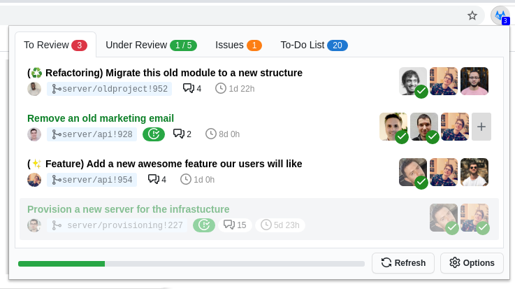
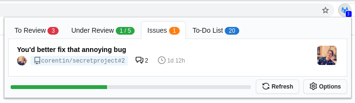
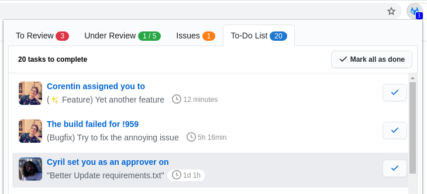

# Git Notify Extension For GitLab

     

_Don't miss any GitLab merge requests or issues and rocket up your productivity._

[Chrome Web Store](https://chrome.google.com/webstore/detail/ekfpkkhpemajcbniegjicehdphdabhop) | [Firefox Add-on](https://addons.mozilla.org/en-US/firefox/addon/gitlab-notify/) | [Microsoft Edge Add-on](https://microsoftedge.microsoft.com/addons/detail/jjnpgaeopmlbaacjkedohiehmeopjoed)

 

**Git Notify for GitLab is able to:**

-   List Merge Requests you are assigned to
-   List Merge Requests you created
-   List your draft Merge Requests
-   List Issues you are assigned to
-   Display your To-Do List
-   Pick a random contributor of a repository to assign them to a MR :rage1:
-   Display the pipelines statuses and unresolved threads for merges requests

It comes with a bunch of features to let you access easily the information you're looking for and is customizable so it fits your needs.

## Screenshots

List of issues:

To-Do list:

## Setup

Install dependencies:

`pnpm ci`

Copy dev config file and set your personal GitLab token in it:

`pnpm run copy-config:setup`

To build **prod**:

`pnpm run build:prod && pnpm run zip`

Then, you get zipped packages for each browser that are supported.

## Assets and Documentation

-   React https://reactjs.org/docs
-   Primer Components https://primer.style/components/
-   Octoicons https://octicons.github.com/
-   Mozilla Documentation for WebExtensions https://developer.mozilla.org/en-US/docs/Mozilla/Add-ons/WebExtensions

## Maintainer

|  |
| --------------------------------------------------------------------------------------------------------------------------- |
| [Corentin Mors](https://pixelswap.fr/)                                                                                      |

## Contributors (thanks for your help!)

| [Paola Ducolin](https://github.com/pducolin) | [Bradley Cushing](https://github.com/bradcush) | [Bastien Granger](https://github.com/bastienGranger) | [Quentin Barbe](https://github.com/forty) |
| -------------------------------------------- | ---------------------------------------------- | ---------------------------------------------------- | ----------------------------------------- |

> [!TIP]
> Original logo credits to [misutakitto](https://www.instagram.com/misutakitto/), use is strictly limited to this project.

## Disclaimer

> [!NOTE]
> This project is not affiliated with GitLab. It is an open-source project maintained by volunteers.
> "GITLAB" wordmark and "GITLAB" logo are the property of GitLab Inc.
