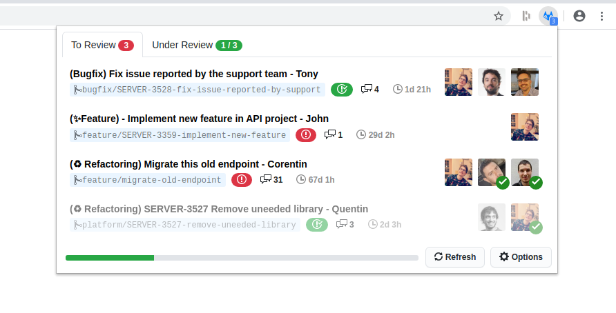

# GitLab Notify Extension

     

_Don't miss any GitLab merge requests or issues and rocket up your productivity._

[Chrome Web Store](https://chrome.google.com/webstore/detail/ekfpkkhpemajcbniegjicehdphdabhop) | [Firefox Add-on](https://addons.mozilla.org/en-US/firefox/addon/gitlab-notify/)

**Gitlab Notify is able to:**

-   List Merge Requests you are assigned to
-   List Merge Requests you created
-   List Issues you are assigned to
-   Display your To-Do List

It comes with a bunch of features to let you access easily the information you're looking for and is customizable so it fits your needs.

## Setup

Install dependencies:

`npm ci`

Copy dev config file and set your personal GitLab token in it:

`npm run copy-config:setup`

To build prod:

`npm run build:prod && npm run zip`

## Assets and Documentation

-   Neutrino https://neutrinojs.org/
-   Neutrino for WebExtensions https://github.com/crimx/neutrino-webextension
-   React https://reactjs.org/docs
-   Primer Components https://primer.style/components/
-   Octoicons https://octicons.github.com/
-   Mozilla Documentation for WebExtensions https://developer.mozilla.org/en-US/docs/Mozilla/Add-ons/WebExtensions

## Maintainer

|  |
| --------------------------------------------------------------------------------------------------------------------------- |
| [Corentin Mors](https://pixelswap.fr/)                                                                                      |

## Contributors (thanks for your help!)

| [Paola Ducolin](https://github.com/pducolin) | [Bradley Cushing](https://github.com/bradcush) |
| -------------------------------------------- | ---------------------------------------------- |

